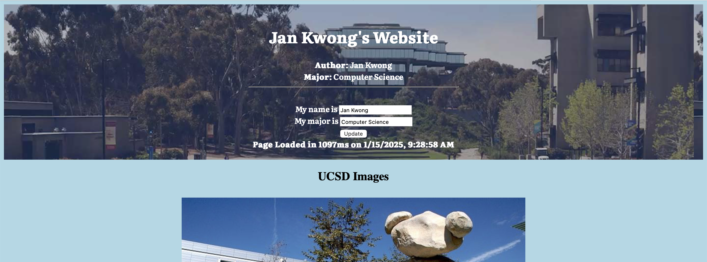
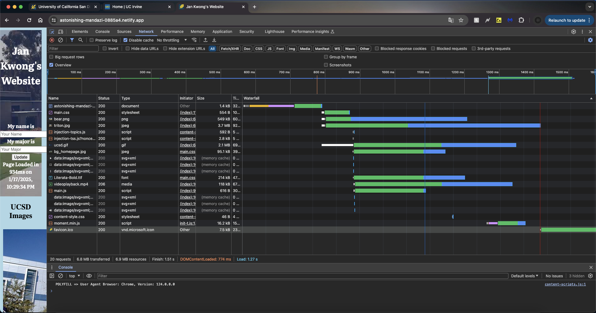
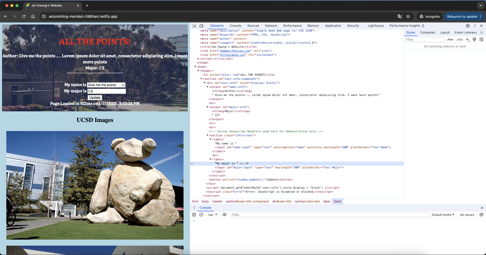
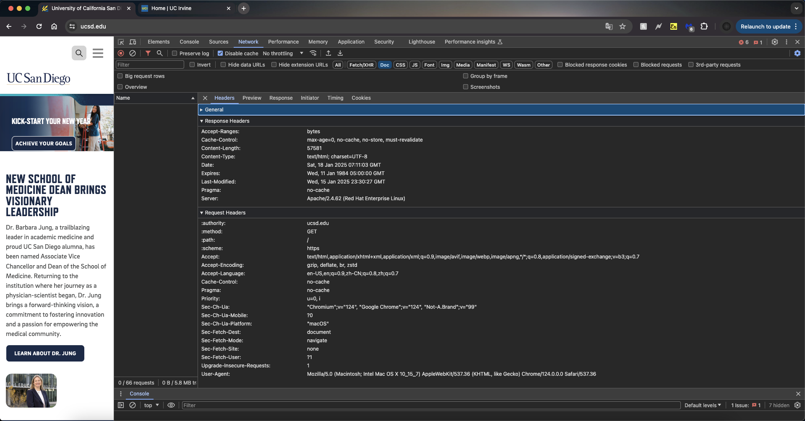
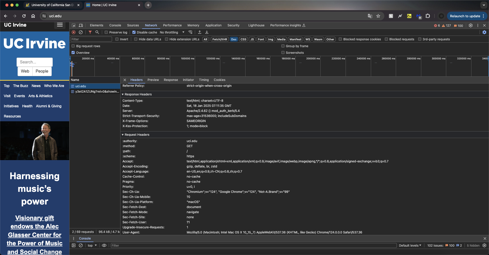
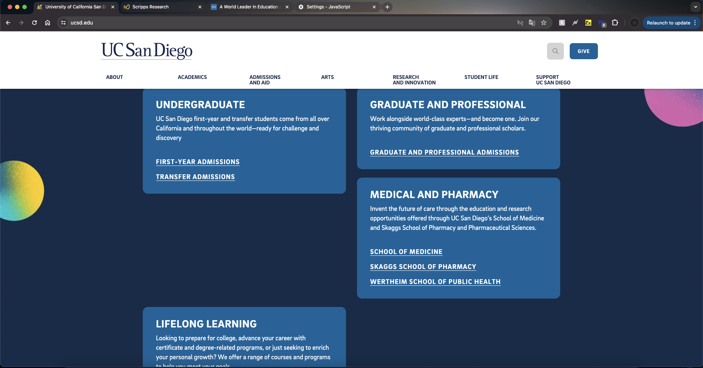
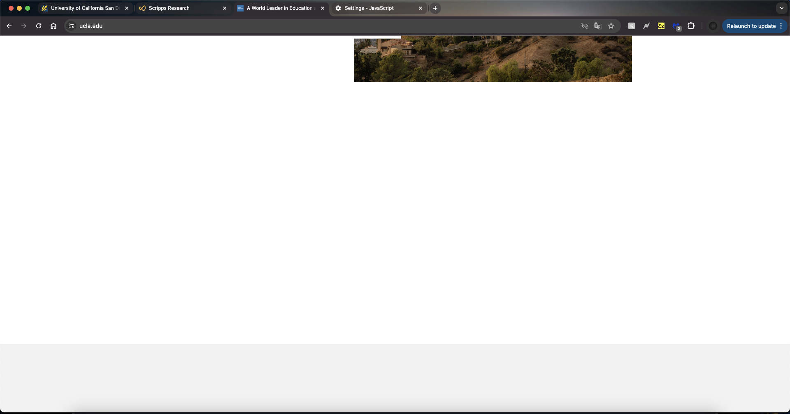
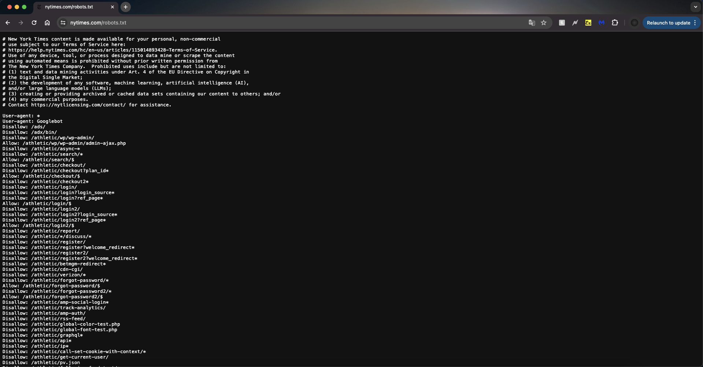

# Link to Site: https://astonishing-mandazi-0885a4.netlify.app

## Part 1:

1. 
2. 1. - HTML: 1
      - CSS: 2
      - JS: 4
      - Font: 1
      - Images: 10
      - Media: 1
      - Other (vnd.microsoft.icon): 1
    2. Total requests: 20
    3. 6.8 MB
    4. 
 3. 

## Part 2:

1. Interacting with ESPN was definitely not easy for me. I wasn't able to navigate to where "Top Headlines" is. The only easy part was the toolbar at the top of the screen. The rest was fairly difficult as I was overloaded with information about the types of the buttons I was on and the content itself. There were a couple times where I likely navigated to the wrong page and had to restart the whole process.
2. The training will not be archived. Navigating through webaim.org was much easier. The difficult part was scanning through all the content to get to where I needed to go, but it was still easier than ESPN's as the information was not as overwhelming. The easy part was that the website layout seemed to be fairly simple. Despite the need to scroll through a lot of elements, I got to where I needed to go fairly quickly. The navigation was straightforward with moslty down-arrows. 

## Part 3:

1. 1. 
   1. 
   2. One blocked element delayed the rendering of all the other elements following it as it blocked the critical rendering path, showing dependencies.
   3. UCSD: 
   - Doc: 1.5%
   - Stylesheets: 15%
   - Scripts: 21%
   - Fonts: 6%
   - Images: 44%
     
     UCI:  
   - Doc: 3.1%
   - Stylesheets: 17%
   - Scripts: 28%
   - Fonts: 3.1%
   - Images: 25%

2. 1. 
   2. I can't seem to use the search bar anymore after disabling JS. When I click the search icon, there is no response.
   3. 
   4. Nothing works after disabling JS since it becomes a blankpage.
   5. 
   6. Similarly, the search bar doesn't work and does not respond on clicks. Some drop-down menus with information about different sports also don't work.

3. 1. Custom
   2. https://www.csuci.edu/dss
   3. Default 
   4. https://jpcatholic.edu/dss
   5. Custom 404 pages are good because of consistent styling and their information availabile to users. Firstly, by creating our own 404 page, we can match its style to our sites, maintaining visual consistency while default 404 pages are not visually appealing or consistent to style of our site. Secondly, we can include any information we would like to give to our users in our custom 404 page (for example, the reason of the 404 error and guides that lead users back to the home page) which likely will reduce user confusion. However, users are basically clueless when faced with a default 404 page as they won't know what has gone wrong that gives them a 404 error.

4. 1. 
   2. The robots.txt file can disclose sensitive information. By highlighting directories or files that are "disallowed", it may reveal areas of the website that are private or sensitive, which may serve as targets of users of malicious intents. If those files are not securely protected, those users can easily access confidential information.
   3. It seems that they are all AIs (such as cohere-ai and GPTBot). NYT may be worried about AIs scrapping their websites as training data to their models. 

5. 1. "Google Hacking" allows security professionals to discover sensitive information exposed online. They can make use of the queries from this database to publicly available information, which will reveal to them security vulnerabilities of the web.
   2. Googlebot is Google's web crawler that crawls through different websites and store these publicly available sites in its index for searching. During this process, it can potentially scrap publicly available sensitive information, making it searchable, which may be problematic. However, this is also exactly what allows for Google Hacking. 
   3. As web developers, we should be concerned with whether Googlebot can potentially crawl through sensitive information of our sites and store it as searchable information. We should ensure that sensitive information is stored securely and protected from web crawlers.
   4. Since the robots.txt file from NYT prohibits web crawlers like Googlebot to scrap their web content (which may then serves as AI training data or publicly searchable information), it can potentially prevent the leakage of sensitive information to the public.
 

