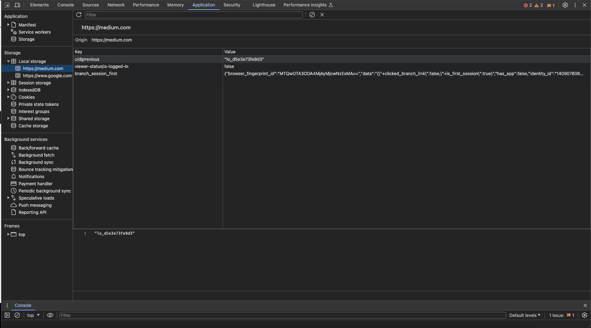
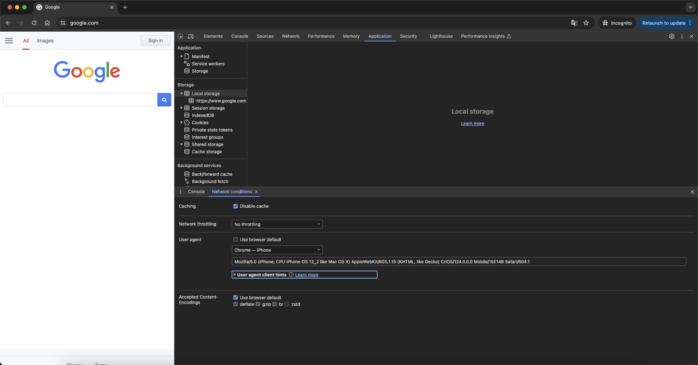
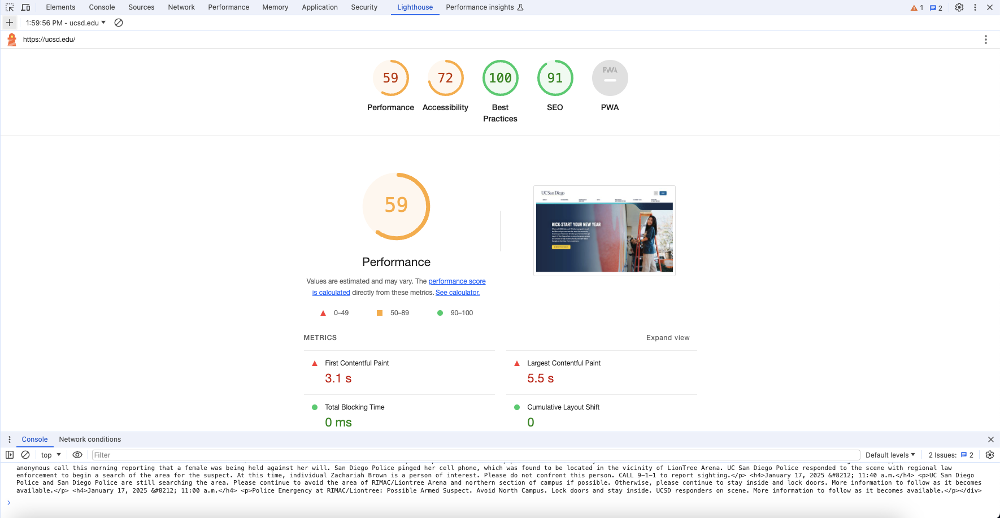
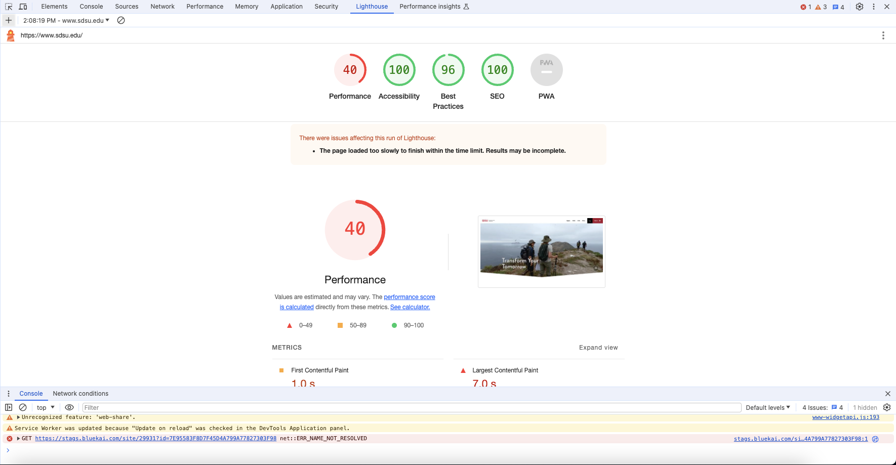
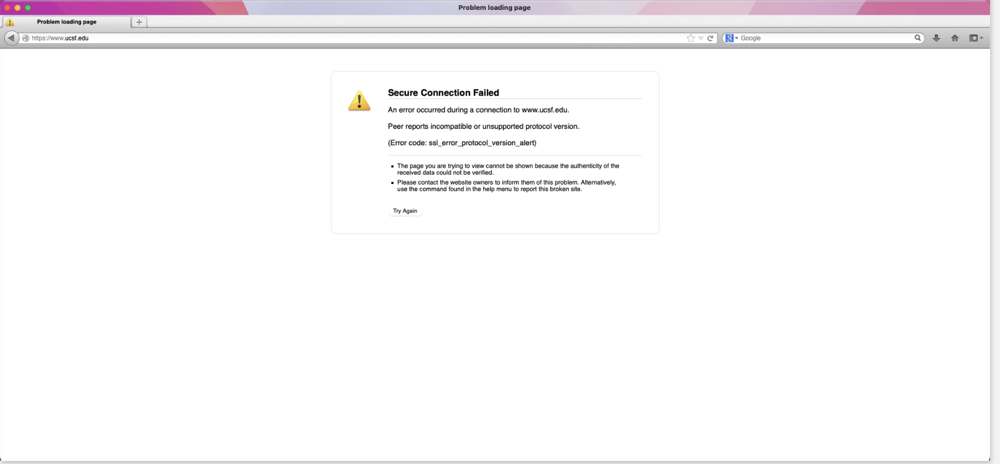

# Link to Site: https://astonishing-mandazi-0885a4.netlify.app

## Part 1:

1. 
2. 1. - HTML: 1
      - CSS: 2
      - JS: 4
      - Font: 1
      - Images: 10
      - Media: 1
      - Other (vnd.microsoft.icon): 1
    2. Total requests: 20
    3. 6.8 MB
    4. 
 3. 

## Part 2:

1. Interacting with ESPN was definitely not easy for me. I wasn't able to navigate to where "Top Headlines" is. The only easy part was the toolbar at the top of the screen. The rest was fairly difficult as I was overloaded with information about the types of the buttons I was on and the content itself. There were a couple times where I likely navigated to the wrong page and had to restart the whole process.
2. The training will not be archived. Navigating through webaim.org was much easier. The difficult part was scanning through all the content to get to where I needed to go, but it was still easier than ESPN's as the information was not as overwhelming. The easy part was that the website layout seemed to be fairly simple. Despite the need to scroll through a lot of elements, I got to where I needed to go fairly quickly. The navigation was straightforward with moslty down-arrows. 

## Part 3:

1. 1. 
   1. 
   2. The "Server" header reveals sensitive details like the authentication method used. It may allow malicious hackers to target vulnerabilities of that authenticatin method, compromising the security of the website.
   3. UCSD: 
   - Doc: 1.5%
   - Stylesheets: 15%
   - Scripts: 21%
   - Fonts: 6%
   - Images: 44%
     
     UCI:  
   - Doc: 3.1%
   - Stylesheets: 17%
   - Scripts: 28%
   - Fonts: 3.1%
   - Images: 25%

2. 1. 
   1. I can't seem to use the search bar anymore after disabling JS. When I click the search icon, there is no response.
   2. 
   3. Nothing works after disabling JS since it becomes a blankpage.
   4. 
   5. Similarly, the search bar doesn't work and does not respond on clicks. Some drop-down menus with information about different sports also don't work.

3. 1. Custom
   1. https://www.csuci.edu/dss
   2. Default 
   3. https://jpcatholic.edu/dss
   4. Custom 404 pages are good because of consistent styling and their information availabile to users. Firstly, by creating our own 404 page, we can match its style to our sites, maintaining visual consistency while default 404 pages are not visually appealing or consistent to style of our site. Secondly, we can include any information we would like to give to our users in our custom 404 page (for example, the reason of the 404 error and guides that lead users back to the home page) which likely will reduce user confusion. However, users are basically clueless when faced with a default 404 page as they won't know what has gone wrong that gives them a 404 error.

4. 1. 
   1. The robots.txt file can disclose sensitive information. By highlighting directories or files that are "disallowed", it may reveal areas of the website that are private or sensitive, which may serve as targets of users of malicious intents. If those files are not securely protected, those users can easily access confidential information.
   2. It seems that they are all AIs (such as cohere-ai and GPTBot). NYT may be worried about AIs scrapping their websites as training data to their models. 

5. 1. "Google Hacking" allows security professionals to discover sensitive information exposed online. They can make use of the queries from this database to publicly available information, which will reveal to them security vulnerabilities of the web.
   1. Googlebot is Google's web crawler that crawls through different websites and store these publicly available sites in its index for searching. During this process, it can potentially scrap publicly available sensitive information, making it searchable, which may be problematic. However, this is also exactly what allows for Google Hacking. 
   2. As web developers, we should be concerned with whether Googlebot can potentially crawl through sensitive information of our sites and store it as searchable information. We should ensure that sensitive information is stored securely and protected from web crawlers.
   3. Since the robots.txt file from NYT prohibits web crawlers like Googlebot to scrap their web content (which may then serves as AI training data or publicly searchable information), it can potentially prevent the leakage of sensitive information to the public.

6. 
   1. 
   - https://www.scoir.com/
   - https://community.whattoexpect.com/forums/san-diego-parents/topic/obgyn-recommendations-at-ucsd-94499479.html
   - https://www.california.com/the-most-fun-things-to-do-around-uc-san-diego/
   - https://quantnet.com/mfe-programs-rankings/
   - https://piazza.com/
   - https://news.ycombinator.com/item?id=579690
   - https://www.ucd.ie/
   - https://www.intedashboard.com/
   - https://smashboards.com/threads/ucla-or-ucsd.162046/
   - https://higher.education.narkive.com/Ce4pesFy/sdsu-or-ucsd-i-ve-gone-in-circles-1-000-times-i-just-need-a-best-guess-where-will-i-be-happiest-and-
   2. For most search engines other than Google, the top result is always from the UCSD admission website. The most popular results are usually from college review sites or sites related to college applications. There're also quite a lot of Reddit posts showing up as results. On the other hand, on Google, the most popular result is from Reddit, and is presented as a group of Reddit posts. Results from forums are also frequent. Personally, I prefer Google because it gives me more opinions from students and parents across different forums rather than from the school itself which would undoubtedly promote itself. 

7. 1. 
   2. Medium has included a hiring post there potentially because they realized that the people who peeked into the console are likely web developers, and putting a job post there would allow them to reach the right audience (potential web developers seeking a job).
   3.  
   It contains information about me, the user, including my log-in status and broswer id. I think this information will be used for user analytics as it includes identifying information about me and my behavior (such as whether I have the app or whether this access is my first).

8. 1. Yes, the UI for Google.com seems to become the one for iPhone.
   2.  
   The UI here, instead of being the computer UI, becomes the UI for cell phones. 

9. - X-Content-Type-Options: nosniff
      - it tells the browser to always use the MIME type declared in the Content-Type header instead of trying to determine the MIME type based on the file's content. 
   - X-Download-Options: noopen
     - it tells the browswer to not open the downloaded file on the browswer but execute the Save option
   - X-Frame-Options: DENY
     - it prevents a page from being displayed in a frame
   - X-Permitted-Cross-Domain-Policies: none
     - this header limits which data external resources can access their domain, and by setting it to none, it allows other domains to embed the application's data in their content
   - X-Render-Origin-Server: Render
     - this header identifies the origin server or service that processed a particular request
   - X-Xss-Protection: 0
     - it disables the browser's built-in cross-site scripting filter

10. 1. 
    2. - Eliminate render-blocking resources
          - It means that there are resources blocking the rendering path, causing a delay in rendering. It suggests delivering critical styles/scripts inline and defer non-critical styles/scripts to increase rendering speed.
        - Reduce unused CSS
          - There are style rules unneeded to render a page correctly but are causing delays in the rendering. It suggests removing these unnecessary style rules.
    3. 
    They got a 40 in performance score while UCSD got a 59.
    4. While SDSU has a lower performance score, they did score higher in the other three criteria, with a 100 in accessbility especially. If we're prioritizing accessibility, then UCSD certainly has more work to do. But if we prioritize performance, then SDSU needs to work on their site.

11. 1. - Chrome: https://chromestatus.com/
       - Firefox: https://developer.mozilla.org/en-US/docs/Mozilla/Firefox/Platform_status
       - Edge: https://docs.microsoft.com/en-us/microsoft-edge/platform/status/ 
       - Safari: https://webkit.org/status/ 
   2. Chrome 53
   3. August 2016
   4. The public release was on Dec 11, 2008, which makes Chrome 16 years old (turning 17 this year). 

12. 1. 
    2. It seems that the older browsers don't support modern protocols, so, when developing sites, we should prioritize support for new versions of browsers. 

13. 1. It's specifying "nosniff".
    2. Cloudflare is a service that improves the security and performance of websites. It uses an edge network that provides content and other services as close to users as possible to ensure the speed of the delivery of information. It also provides security by protecting Internet properties from malicious activities like DDoS attacks and malicious bots.

14. 
